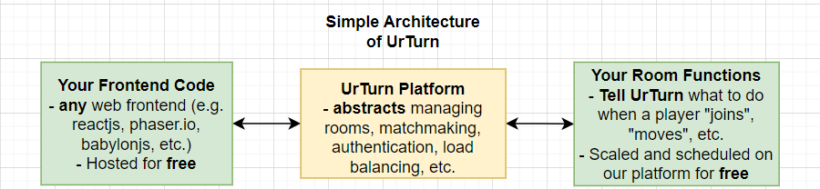

# Introduction

## What UrTurn Is

[UrTurn](https://www.urturn.app/) is a game platform that hosts and handles **all infrastructure for your game**: networking, multiplayer, matchmaking, and data storage.

The framework lets you modify game state of a room in a **transactional** and **event-based** manner. Just define how to modify game states on each event, and that's it (no infrastructure headaches, no worrying about scale again).

// TODO:KEVIN need to put cloud around this backend

### Perfect for

1. Turn based games (e.g. any board game)
2. Word games with several updates per second
3. Games that can be represented as state machines
4. Monetizing Single Player Games (coming soon)

### Opinionated Where It Matters

We are obsessed with a great developer experience. This means we abstract away complicated infrastructure in scalable and best practice way that just makes sense.

## What UrTurn is NOT

:::info

UrTurn is **NOT** opinionated on the frontend of your game or your dev environment.

:::

- Continue to use your favorite frontend web technologies (e.g. vanilla HTML5, ReactJS, PhaserIO, BabylonJS, etc.), and hook into UrTurn using the `@urturn/client`.
- Continue to use your favorite IDE for coding with JavaScript, and continue using your favorite dev tools and open source libraries.

:::caution

UrTurn is **NOT** a real time gaming framework

:::

- Despite this limitation, there is a set of rich potential use cases for it that can make exciting and fun games. See the [front page](https://www.urturn.app).
- Join the early release wait list on [discord](https://discord.gg/myWacjdb5S), so we can notify you when we add support.

:::caution

UrTurn is **NOT** fully stable *yet*. It is in `Alpha`.

:::

This means that there may be some breaking changes. We will try to avoid them as much as possible, and will always notify developers in our [discord](https://discord.gg/myWacjdb5S).
