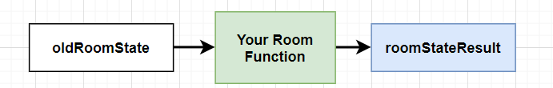

import Tabs from '@theme/Tabs';
import TabItem from '@theme/TabItem';

# Flow of a Simple Game

## TicTacToe

Let's walk through a simple TicTacToe game that you made:

### 1. Player `Billy` clicks **Play**

[](./click_play_button_tictactoe.gif)

UrTurn calls your [room function](/docs/API/room-functions) implementation of [`onRoomStart`](/docs/API/room-functions#onroomstart-required) to initialize the room state.

<Tabs>
  <TabItem value="result" label="Initial roomState" default>

```json
{
  "joinable": true, // defaults to true, (when set to false, UrTurn prevents any new players from joining the room)
  "finished": false, // defaults to false, (when set to true, UrTurn prevents any new moves from being made)
  "state": { // this field can be any JSON object that you define. This was provided in the roomStateResult by the room function above.
    "status": "preGame",
    "board": [
      [
        null,
        null,
        null
      ],
      [
        null,
        null,
        null
      ],
      [
        null,
        null,
        null
      ]
    ],
    "winner": null,
  },
  "version": 0, // metadata controlled by UrTurn; as each new `RoomState` gets created, this gets incremented by 1
  "players": [], // metadata controlled by UrTurn; when a player joins the room, they are added here to the list. When they quit the room, they are removed.
}
```

  </TabItem>
  <TabItem value="onRoomStart" label="onRoomStart code">

```js title="src/main.js"
function onRoomStart() {
  return {
    state: {
      status: Status.PreGame,
      board: [
        [null, null, null],
        [null, null, null],
        [null, null, null],
      ],
      winner: null, // null means tie if game is finished, otherwise set to the plr that won,
    },
  };
}
```

  </TabItem>
</Tabs>

UrTurn calls [`onPlayerJoin`](/docs/API/room-functions#onplayerjoin-required) function with `Billy` player object and the previous [`roomState`](/docs/API/types#roomstate) created earlier.

<Tabs>
  <TabItem value="result" label="roomState result" default>

```json
{
  "joinable": true, // room should still let players join because there are not enough players to play tictactoe yet
  "finished": false,
  "state": {
    "status": "preGame",
    "board": [
      [
        null,
        null,
        null
      ],
      [
        null,
        null,
        null
      ],
      [
        null,
        null,
        null
      ]
    ],
    "winner": null
  },
  // highlight-start
  "version": 1, // incremented because our room function successfully modified the state
  "players": [ // new player is in the player list
    {
      "id": "id_0",
      "username": "billy"
    }
  ]
  // highlight-end
}
```

  </TabItem>
  <TabItem value="onPlayerJoin" label="onPlayerJoin Code">

```js title="src/main.js"
function onPlayerJoin(player, roomState) {
  const { players, state } = roomState;
  if (players.length === 2) { // enough players to play the game
    state.status = Status.InGame;
    state.plrMoveIndex = 0; // keep track of who’s turn it is
    return { // return modifications we want to make to the roomState
      state,
      joinable: false, // we should not allow new players to join the game, tictactoe only needs two players
    };
  }
  // our first player joined, we should do nothing (not enough players yet to start).
  return {};
}
```

  </TabItem>
</Tabs>

Updates are propagated to clients by sending an event to `client.events.on('stateChanged')` so your game frontend can update the view for the player.

[](./tictactoe_1_billy_waiting.png)

### 2. Player `Sarah` clicks **Play**

UrTurn matchmaking system puts `Sarah` to the same room as `Billy`.

The same function [`onPlayerJoin`](/docs/API/room-functions#onplayerjoin-required) is called with `Sarah` player object and the previous [`roomState`](/docs/API/types#roomstate), which produces the result (changes are highlighted):

```json
{
  // highlight-next-line
  "joinable": false, // no longer joinable as we have enough players!
  "finished": false,
  "state": {
    // highlight-next-line
    "status": "inGame", // game is now in game and we can start playing!
    "board": [
      [
        null,
        null,
        null
      ],
      [
        null,
        null,
        null
      ],
      [
        null,
        null,
        null
      ]
    ],
    "winner": null,
    "plrMoveIndex": 0
  },
  // highlight-next-line
  "version": 2,
  "players": [
    {
      "id": "id_0",
      "username": "billy"
    },
    // highlight-start
    { // new player "sarah", added by UrTurn runner
      "id": "id_1",
      "username": "sarah"
    }
    // highlight-end
  ]
}
```

Updates are propagated to all clients:

<Tabs>
  <TabItem value="Sarah" label="Sarah's browser" default>

[](./tictactoe_2_sarah_joined.png)

  </TabItem>
  <TabItem value="Billy" label="Billy's browser">

[](./tictactoe_2_sarah_joined_billy_view.png)

  </TabItem>
</Tabs>

### 3. `Billy` puts `X` in top left corner

<Tabs>
  <TabItem value="Billy moves" label="Billy's browser" default>

[](./tictactoe_3_billy_moves.gif)

  </TabItem>
  <TabItem value="Sarah" label="Sarah's browser">

[](./tictactoe_3_billy_moves_sarah_view.gif)

  </TabItem>
</Tabs>

Your frontend calls `client.makeMove({ x: 0, y: 0 })` whenever it detected `billy` clicking a button on the board

:::info

The `client.makeMove` function takes any move JSON!

:::

UrTurn calls [`onPlayerMove`](/docs/API/room-functions#onplayermove-required) function to handle the arbitrary move:

<Tabs>
  <TabItem value="result" label="roomState result">

Resulting [`roomState`](/docs/API/types#roomstate) (changes are highlighted):

```json
{
  "joinable": false,
  "finished": false,
  "state": {
    "status": "inGame",
    "board": [
      [
        // highlight-next-line
        "X", // Billy’s move!
        null,
        null
      ],
      [
        null,
        null,
        null
      ],
      [
        null,
        null,
        null
      ]
    ],
    "winner": null,
    // highlight-next-line
    "plrMoveIndex": 1 // next move is Sarah’s
  },
  // highlight-next-line
  "version": 3,
  "players": [
    {
      "id": "id_0",
      "username": "billy"
    },
    {
      "id": "id_1",
      "username": "sarah"
    }
  ]
}
```

  </TabItem>
  <TabItem value="onPlayerMove" label="onPlayerMove code">

```js title="src/main.js"
function onPlayerMove(player, move, roomState) {
  const { state, players } = roomState;
  const { board, plrMoveIndex } = state;
  const { x, y } = move;
  if (state.status !== Status.InGame) { // must be in the game (clients may spoof and send onPlayerMove with whatever values they want!)
    throw new Error("game is not in progress, can't make move!"); // error will be propagated to the client.makeMove() call
  }
  if (players[plrMoveIndex].id !== player.id) { // make sure it is the player’s turn
    throw new Error(`Its not this player's turn: ${player.username}`);
  }
  if (board[x][y] !== null) {
    throw new Error(`Invalid move, someone already marked here: ${x},${y}`);
  }

  board[x][y] = players[0].id === player.id ? ‘X’ : ‘O’; // set the board square to the correct mark;

  // game may be finished
  // logic is too long to show here, but checks if an “three marks in a row” or if no more possible moves left
  const [isEnd, winner] = isEndGame(board, players);
  if (isEnd) {
    // transitions game to end
    state.status = Status.EndGame;
    state.winner = winner;
    return { state, finished: true }; // game is now finished, modify the "finished" metadata so UrTurn can properly catalogue this room
  }

  // alternate the current player move so next player can make a move
  state.plrMoveIndex = plrMoveIndex === 0 ? 1 : 0;
  return { state };
}
```

  </TabItem>
</Tabs>

### 4. [Room functions](/docs/API/room-functions) are [pure functions](/docs/API/room-functions#all-functions-are-pure-functions)

Notice how all of the implemented room functions ([`onRoomStart`](/docs/API/room-functions#onroomstart-required), [`onPlayerJoin`](/docs/API/room-functions#onplayerjoin-required), etc.) takes in the current [`roomState`](/docs/API/types#roomstate) and several other arguments and returns a [`roomStateResult`](/docs/API/types#roomstateresult).

Data should feel like a natural flow of transformations throughout time:


This makes it easier to understand, debug, and test your [room functions](/docs/API/room-functions). More on [pure functions](/docs/API/room-functions#all-functions-are-pure-functions).

## Getting the hang of it?

:::success

You just write code for **how state changes** based on various room events - player joins, quits, makes move, etc.

UrTurn takes care of the rest.

:::

Try implementing the entire [TicTacToe game](/docs/getting-started/tictactoe) and deploying it to production so anyone can play it!
