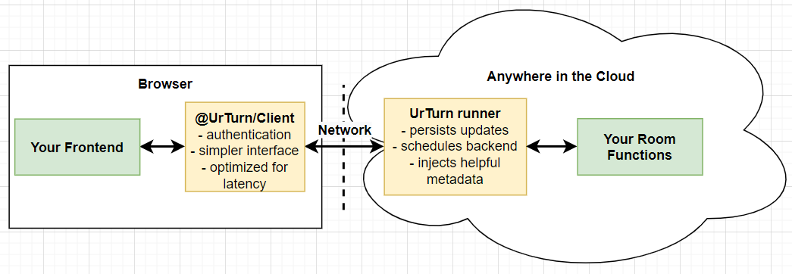

# Concepts

## Basic architecture

This diagram shows 4 systems. You write code for the `web frontend` and the [`room functions`](/docs/API/backend#functions). We write code for the `runner` and `client` so you don't have to.

:::success

All infrastructure shown is managed, scaled, and operated by UrTurn.

For you, it will feel like your frontend is seamlessly communicating directly with your [room functions](/docs/API/backend#functions).

:::

:::caution

**The user is able to control the game frontend.**
This means critical game logic should always be in the backend (e.g. validation of user data, handling transition of state, etc.), which is managed by our cloud servers.

:::

## Room

- Rooms are instances of [games](/docs/Introduction/Concepts#game).
- Rooms will have an associated [`RoomState`](/docs/API/backend#roomstate) to track the current state of the room.
- Players create new rooms whenever they click play on your game. UrTurn will automatically place players together in a room if it is public.
- `private` rooms are created by players when they click `create private room`.
  - You can handle private rooms differently than public rooms (see [roomStartContext](/docs/API/backend#roomstartcontext)) in your [room functions](/docs/API/backend#functions).
  - For example, you might want players to be able to control various game settings or rules in a private room.
- If a user accidentally closes their browser, they may reopen it to view the room again (exception: see [disconnectTimeout](/docs/Introduction/Concepts#automatic-disconnect-handling))

## Game

Each game can have a thumbnail, title, description, and specific code related to it that is run whenever a room is created.

## Automatic Disconnect Handling

- When a user is disconnected from a `public` room, the user will be automatically kicked from the room with `onPlayerQuit` after `30 seconds`.
- This does not apply to `private` rooms! Meaning, even if a player disconnects from a private room indefinitely, they will not be forced out of it.
