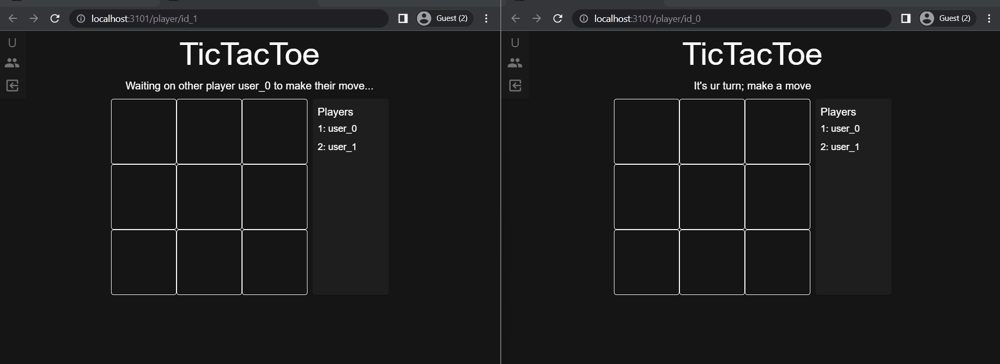

import Tabs from '@theme/Tabs';
import TabItem from '@theme/TabItem';

# Multiplayer TicTacToe

## What you are making



:::success
Play the final [version](https://www.urturn.app/games/626eac7c65667f00160a6b42). Playing the game will help you envision what the underlying logic will look like.

Ask yourself:

- How do you define what happens when a player moves?
- How can you tell if a player won the game?
:::

## Setup

Generate the tictactoe tutorial locally:

```bash
npx @urturn/runner init --tutorial first-game # answer prompts
cd first-game
```

The UI is provided for you. Your goal is to implement the underlying logic ([room functions](/docs/API/room-functions)) which determine the resulting state after any event (e.g. player move, joins, etc.).

### File/Folder structure

```bash
game
└───src # room logic goes here
│   │   main.js # room functions (e.g. onRoomStart, onPlayerMove, etc.)
|   |   util.js # helper functions (e.g. evaluateBoard)
│   
└───frontend # Tictactoe UI code lives here
|   │   ...frontend files
|   ...other files # not important for this tutorial
```

:::info
There are several `// TODO:` statements scattered across the files, `src/main.js` and `src/util.js`, to help guide you.
:::

## Defining how state changes

Start up the game and play around.

```bash
npm run dev
```

:::info
The [runner](/docs/API/runner) will immediately open a new window.

You will see a console that let's you easily debug/inspect the global state of your game.

You will also notice that if you `add`, `remove` a player or try to make a `move` on the tictactoe board, none of the state will change. So let's fix that!
:::

### Initializing state

We need to define what the **initial state** of the room looks like.

All state related to a room is held within the [RoomState](/docs/API/types#roomstate). We modify this object by returning the [RoomStateResult](/docs/API/types#roomstateresult).

:::success
The runner will automatically hot reload changes when **make changes** and **save**
:::

:::info
Now, modify the [`onRoomStart`](/docs/API/room-functions#onroomstart-required) function.

Implement the `TODO` statements in `onRoomStart` in the file `src/main.js`, and then check your work with the solution.
:::

<Tabs>
  <TabItem value="initial" label="TODO" default>

```js title="src/main.js"
function onRoomStart() {
  /**
  // highlight-start
    * TODO: define the fields:
    * state.status (hint: use Status enum)
    * state.plrIdToPlrMark
    * state.plrMoveIndex
    * state.board
    * state.winner
  // highlight-end
  */
  const state = {};
  return { state };
}
```

  </TabItem>
  <TabItem value="solution" label="onRoomStart Solution">

```js title="src/main.js"
function onRoomStart() {
  return {
    state: {
      // highlight-start
      status: Status.PreGame,
      plrIdToPlrMark: {}, // map from plrId to their mark (X or O)
      plrMoveIndex: 0, // track who's move it is
      board: [
        [null, null, null],
        [null, null, null],
        [null, null, null],
      ],
      winner: null,
      // highlight-end
    },
  };
}
```

  </TabItem>
</Tabs>

:::success
You should see your modifications to the initial state show up in the console!
:::

### Players joining

:::info
Modify the [`onPlayerJoin`](/docs/API/room-functions#onplayerjoin-required) function to handle when a player joins.

Implement the `TODO` statements in `onPlayerJoin`, and then check your work with the solution.
:::

:::success
While implementing, try adding players. Try adding 3 players to see what happens.
::: 

<Tabs>
  <TabItem value="initial" label="TODO" default>

```js title="src/main.js"
function onPlayerJoin(player, roomState) {
  const { players, state } = roomState;
  if (players.length === 2) { // enough players to play the game
    // highlight-next-line
    // TODO: modify state to start the game
    return {
      // highlight-start
      // TODO: tell UrTurn to NOT allow anymore players in this room
      // TODO: return the modified state
      // highlight-end
    };
  }

  // still waiting on another player so make no modifications
  return {};
}
```

  </TabItem>
  <TabItem value="solution" label="onPlayerJoin Solution">

```js title="src/main.js"
function onPlayerJoin(player, roomState) {
  const { players, state } = roomState;
  if (players.length === 2) { // enough players to play the game
    // start the game and set the player's marks
    // highlight-start
    state.status = Status.InGame;
    state.plrIdToPlrMark[players[0].id] = Mark.X;
    state.plrIdToPlrMark[players[1].id] = Mark.O;
    // highlight-end
    // return modifications we want to make to the roomState
    return {
      // highlight-start
      state,
      // tell UrTurn to NOT allow anymore players in this room
      joinable: false,
      // highlight-end
    };
  }

  // still waiting on another player so make no modifications
  return {};
}
```

  </TabItem>
</Tabs>

### Players leaving

:::info
Modify the [`onPlayerQuit`](/docs/API/room-functions#onplayerquit-required) function to handle when a player quits.

Implement the `TODO` statements in `onPlayerQuit`, and then check your work with the solution.
:::

:::success
While implementing, try adding players and then removing them. Does the console show the state you expect?
:::

<Tabs>
  <TabItem value="initial" label="TODO" default>

```js title="src/main.js"
function onPlayerQuit(player, roomState) {
  const { state, players } = roomState;

  state.status = Status.EndGame;
  if (players.length === 1) {
    // highlight-start
    // TODO: when a player quits and there is another player, we should default the winner to
    // be the remaining player
    // highlight-end
    return {
      // highlight-start
      // TODO: properly tell UrTurn the room is over and no longer joinable
      // (hint: modify finished, joinable, state fields)
      // highlight-end
    };
  }
  return {
    // highlight-start
    // TODO: when a player quits and there was no other player, there is no winner but we should
    // properly tell UrTurn the room is over and no longer joinable
    // (hint: modify finished and joinable fields)
    // highlight-end
  };
}
```

  </TabItem>
  <TabItem value="solution" label="onPlayerQuit Solution">

```js title="src/main.js"
function onPlayerQuit(player, roomState) {
  const { state, players } = roomState;
  state.status = Status.EndGame;
  if (players.length === 1) {
    // highlight-start
    const [winner] = players;
    state.winner = winner;
    return { state, joinable: false, finished: true };
    // highlight-end
  }
  // highlight-next-line
  return { joinable: false, finished: true };
}
```

  </TabItem>
</Tabs>

### Helper functions

Before we approach handling player moves, let's implement the helper function `evaluateBoard` for determining if the game is finished and who won.

:::info
Implement the `TODO` statements in `evaluateBoard`, and then check your work with the solution.

Read the doc string for the function to understand what we should return!
:::

:::caution
There are many ways to implement tictactoe evaluation logic, so don't be discouraged if your implementation doesn't look exactly like ours.
:::

<Tabs>
  <TabItem value="initial" label="TODO" default>

```js title="src/util.js"
export const evaluateBoard = (board, plrIdToPlrMark, players) => {
  // highlight-start
  // TODO: check for tie and return correct result

  /**
   * TODO: check for a winner
   * - check rows
   * - check columns
   * - check diagonals
   */

  // TODO: return default not finished
  // highlight-end
};
```

  </TabItem>
  <TabItem value="solution" label="evaluateBoard Solution">

```js title="src/util.js"
export const evaluateBoard = (board, plrIdToPlrMark, players) => {
  // calculate markToPlr map
  const [XPlayer, OPlayer] = plrIdToPlrMark[players[0].id] === Mark.X ? players : players.reverse();
  const markToPlr = {
    [Mark.X]: XPlayer,
    [Mark.O]: OPlayer,
  };

  // highlight-start
  // check for tie
  if (!board.some((row) => row.some((mark) => mark === null))) {
    return {
      finished: true,
      tie: true,
    };
  }
  const winningLine = [ // all possible lines to check
    // rows
    [[0, 0], [0, 1], [0, 2]],
    [[1, 0], [1, 1], [1, 2]],
    [[2, 0], [2, 1], [2, 2]],
    // columns
    [[0, 0], [1, 0], [2, 0]],
    [[0, 1], [1, 1], [2, 1]],
    [[0, 2], [1, 2], [2, 2]],
    // diagonals
    [[0, 0], [1, 1], [2, 2]],
    [[2, 0], [1, 1], [0, 2]],
  ].find((indexes) => { // find the first line that has 3-in-a-row
    const [[firstI, firstJ]] = indexes;
    const firstMark = board[firstI][firstJ];
    const isSame = indexes.every(([i, j]) => board[i][j] === firstMark);
    return firstMark != null && isSame;
  });

  if (winningLine != null) { // winning line was found
    const [i, j] = winningLine[0];
    const mark = board[i][j];
    return { finished: true, winner: markToPlr[mark] };
  }

  return { finished: false };
  // highlight-end
};
```

  </TabItem>
</Tabs>

### Player Moves

:::info
Implement the `TODO` statements in [`onPlayerMove`](/docs/API/room-functions#onplayermove-required), and then check your work with the solution.
:::

<Tabs>
  <TabItem value="initial" label="TODO" default>

```js title="src/main.js"
function onPlayerMove(player, move, roomState) {
  const { state, players, logger } = roomState;
  const { plrMoveIndex, plrIdToPlrMark } = state;
  const { x, y } = move;
  // highlight-start
  // TODO: validate player move and throw sensible error messages
  // 1. what if a player tries to make a move when the player is not in game?
  // 2. what if a player makes a move and its not their turn?
  // 3. what if a player makes a move on the board where there was already a mark?
  // TODO: mark the board
  // highlight-end

  // check if the game is finished
  const result = evaluateBoard(state.board, plrIdToPlrMark, players);
  if (result?.finished) {
    // highlight-start
    // TODO: handle different cases when game is finished, using the values calculated from
    // evaluateBoard() call
    return {
      // TODO: include state modifications so UrTurn updates the state
      // TODO: tell UrTurn that the room is finished, which lets UrTurn display the room correctly
    };
    // highlight-end
  }

  // highlight-next-line
  // TODO: Set the plr to move to the next player (hint: update state.plrMoveIndex)
  return { state };
}
```

  </TabItem>
  <TabItem value="solution" label="onPlayerMove Solution">

```js title="src/main.js"
function onPlayerMove(player, move, roomState) {
  const { state, players } = roomState;
  const { plrMoveIndex, plrIdToPlrMark } = state;
  const { x, y } = move;

  // highlight-start
  // validate player moves
  if (state.status !== Status.InGame) {
    throw new Error("game is not in progress, can't make move!");
  }
  if (players[plrMoveIndex].id !== player.id) {
    throw new Error(`Its not this player's turn: ${player.username}`);
  }
  if (state.board[x][y] !== null) {
    throw new Error(`Invalid move, someone already marked here: ${x},${y}`);
  }
  // highlight-end

  // highlight-start
  // mark the board
  state.board[x][y] = plrIdToPlrMark[player.id];
  // highlight-end

  // check if the game is finished
  const { winner, tie, finished } = evaluateBoard(state.board, plrIdToPlrMark, players);
  if (finished) {
    // highlight-start
    state.status = Status.EndGame;
    state.winner = winner;
    state.tie = tie;
    // tell UrTurn that the room is finished, which let's UrTurn index rooms properly and display
    // finished rooms to players correctly
    return { state, finished: true };
    // highlight-end
  }

  // highlight-start
  // Set the plr to move to the next player
  state.plrMoveIndex = (plrMoveIndex + 1) % 2;
  return { state };
  // highlight-end
}
```

  </TabItem>
</Tabs>

:::success
That's it! Now try adding two players and play around with it.
:::

## What's Next?

You can [**deploy**](/docs/Getting-Started/deploying-your-game) your game to UrTurn in a couple of minutes! Immediately play with random people, or create private rooms and play with close friends!

:::success
Notice that you didn't have to worry about:

- How to communicate between two players
- How to manage room creation, matchmaking, and scaling

With Urturn you get to focus on your game logic, without worrying about **unnecessary infrastructure** problems.
:::

If you think you are up for the challenge. Try making a more advanced game, [Semantle Battle](/docs/Getting-Started/semantle-battle). Or just start making your own [game](/docs/Getting-Started/runner-init)!
