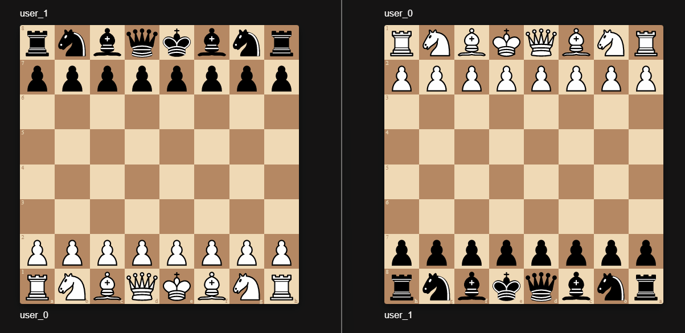

import Tabs from '@theme/Tabs';
import TabItem from '@theme/TabItem';

# Chess Tutorial

## What you are making

You can play the final version [here](https://www.urturn.app/play/chess).



:::caution
This is an **advanced tutorial** so it will move fast.

We expect you to have a basic understanding what [UrTurn is](/docs).
:::

## Setup

Generate the chess tutorial locally:

```bash
npx @urturn/runner init --tutorial chess # answer prompts
cd chess
```

The UI is provided for you. Your goal is to implement the underlying logic ([room functions](/docs/API/room-functions)) which determine the resulting state after any event (e.g. player move, joins, etc.).

### Defining Initial State

We've already defined the initial state in `onRoomStart`. These values are understood and acted upon by the frontend provided.

```json
{
  "state": {
    // simple map of plrId to the color they are playing as "white" or "black"
    "plrIdToColor": {},
    // string representation of the board https://en.wikipedia.org/wiki/Forsyth%E2%80%93Edwards_Notation
    "fen": null,
    // player JSON object that won the game
    "winner": null,
    // the string representation of a location on the board of the
    // final position of the last moved piece (e.g. "e4")
    "lastMovedSquare": null,
  },
}
```

Your goal is to define the other 3 functions `onPlayerJoin`, `onPlayerMove`, `onPlayerQuit` for a fully functioning chess game. Fortunately, the fundamental chess logic has been implemented for us with the [chess.js package](https://www.npmjs.com/package/chess.js).

### Players joining

<Tabs>
  <TabItem value="initial" label="TODO" default>

```js title="src/main.js"
function onPlayerJoin(player, roomState) {
  // TODO: implement what to do when player joins game
  return {}
}
```

  </TabItem>
  <TabItem value="solution" label="onPlayerJoin Solution">

```js title="src/main.js"
function onPlayerJoin(player, roomState) {
  const { players, state } = roomState;
  if (players.length === 2) {
    const game = new Chess();
    state.fen = game.fen();
    state.plrIdToColor[players[1].id] = Color.Black;
    return { joinable: false, state };
  }

  // default first player to white to simplify
  state.plrIdToColor[players[0].id] = Color.White;
  return { state };
}
```

  </TabItem>
</Tabs>

### Players quitting

<Tabs>
  <TabItem value="initial" label="TODO" default>

```js title="src/main.js"
function onPlayerQuit() {
  // TODO: handle when player quits the game before it finishes
  return {};
}
```

  </TabItem>
  <TabItem value="solution" label="onPlayerQuit Solution">

```js title="src/main.js"
function onPlayerQuit(player, roomState) {
  const { state, players } = roomState;
  if (players.length === 1) {
    const [winner] = players;
    state.winner = winner;
    return { state, finished: true };
  }
  return { joinable: false, finished: true };
}
```

  </TabItem>
</Tabs>

### Players making chess moves

<Tabs>
  <TabItem value="initial" label="TODO" default>

```js title="src/main.js"
function onPlayerMove() {
  // TODO: handle when player quits the game before it finishes
  return {};
}
```

  </TabItem>
  <TabItem value="solution" label="onPlayerMove Solution">

```js title="src/main.js"
function onPlayerMove(player, chess, roomState) {
  const { state } = roomState;
  const { fen } = state;
  if (fen == null) {
    throw new Error('Still waiting on another player!');
  }
  const game = new Chess(fen);
  const turnColor = game.turn() === 'w' ? Color.White : Color.Black;
  if (turnColor !== state.plrIdToColor[player.id]) {
    throw new Error('It is not your turn!');
  }
  const result = game.move(move);
  if (result == null) {
    throw new Error('Invalid chess move!');
  }
  state.fen = game.fen();
  state.lastMovedSquare = move;

  if (game.isGameOver()) {
    if (game.isCheckmate()) {
      state.winner = player;
    }
    return { state, finished: true };
  }

  return { state };
}
```

  </TabItem>
</Tabs>

:::success
That's it! Now we have a chess game that properly handles validation of player moves, and updating the state based on player moves.
:::

## What's Next?

You can [**deploy**](/docs/Getting-Started/deploying-your-game) your game to UrTurn in a couple of minutes! Immediately play with random people, or create private rooms and play with close friends!

### Stretch goal

Try implementing the classic chess move timers with `client.now()`. The idea is that clients initiate a `client.makeMove()` call when they detect the game to be finished and the `onPlayerMove` function validates this request.

:::caution
Read more about [server side timers](/docs/Advanced/timer-triggers), which will make this much easier.
:::

:::caution
Tutorial with chess move timers is coming soon. Join our [Discord](https://discord.gg/myWacjdb5S) to learn more about it.
:::
