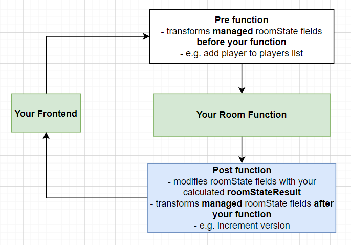

# Room Functions

:::success

These are the functions that you define to handle various events and tell UrTurn how to update the [`roomState`](/docs/API/types#roomstate) for a room.

:::

## Flow

All functions follow this flow when handling an event:


## Pure Functions

All room functions are `pure`:

1. return values are identical for identical arguments.
2. has no side effects within the function itself.

:::caution

Avoid modifying any variables scoped outside of the function, as there is **no guarantee** those modifications will last within the same room and may affect other rooms.

:::

Using **global constants is fine**, or loading in constants from an external file.

:::caution

Common mistake is to forget returning the [`roomStateResult`](/docs/API/types#roomstateresult). Make sure you are returning any resulting state, otherwise the changes will not be applied!

:::

## ACID Transactions

All room functions are ACID transactions:

1. `Atomic`: either all updates returned are fully completed or completely fail. This is important for handling functions like player purchases; you don’t want a player to be charged Urbux and fail to give them their desired item. This prevents data corruption of your roomState.
2. `Consistent`: your functions will never be given partial data or corrupt data; they will always get the latest [`roomState`](/docs/API/types#roomstate) for the room.
3. `Isolated`: you are guaranteed that functions for a given room are handled one by one. No two functions can corrupt each other.
4. `Durable`: successful room functions are guaranteed to survive system failure. Even if UrTurn goes down, or has partial outages, your data for each room should survive.

## `onRoomStart` **Required**

```ts
onRoomStart = (roomState: RoomState) => RoomStateResult
```

- Use this function to initialize your board game state.
- Runs when the room is first initialized, as triggered by these actions:
  1. When a private room is created (player clicks *Create Private Room*).
  2. When a room is created for the matchmaking queue (player clicks *Play*).
- Fails on error (when user clicks play or attempts start a game, it will show them an error and will not start the game).
- `Returns` the [RoomStateResult](/docs/API/types#roomstateresult).

## `onPlayerJoin` **Required**

```ts
onPlayerJoin = (player: Player, roomState: RoomState) => RoomStateResult
```

- Runs when a player joins the room, including when the room is created (i.e. the player clicks *Play* or *Create Private Room*).
- Fails on error (when user clicks play and joins a game, it will show them an error snackbar).
- If `roomState.joinable` is `true` then it is **guaranteed** that no player will be added to the room and `onPlayerJoin` will never be called for a player.
- `Returns` the [RoomStateResult](/docs/API/types#roomstateresult).

## `onPlayerQuit` **Required**

```ts
onPlayerQuit = (player: Player, roomState: RoomState) => RoomStateResult
```

- Runs when a player quits the game.
- A player can quit the game by manually clicking the ***quit*** button.
- Only players in the room, can quit the room (e.g. we can't call `onPlayerQuit` with a player not known to the room).
- `Returns` the [RoomStateResult](/docs/API/types#roomstateresult).

:::caution

`onPlayerQuit` is **forced**. Even if an error occurs in your code, we will force our own logic to be executed (e.g. removing `player` from the `roomState.players` list).

This may put the [`roomState`](/docs/API/types#roomstate) for the room in a corrupt state depending on your code, so you should avoid erroring in this function.

:::

## `onPlayerMove` **Required**

```ts
onPlayerMove = (player: Player, move: Move, roomState: RoomState) => RoomStateResult
```

- Runs when a player moves (i.e. when [`client.makeMove()`](/docs/API/client#clientmakemovemove-move) is called with the [`move`](/docs/API/types#move) JSON object).
- Fails on error. The client triggering this will receive your error as a return value.
- `Returns` the [RoomStateResult](/docs/API/types#roomstateresult).

:::info

If a player is trying to do something impossible/against game rules, then it is **recommended** to throw an error, so you can handle it in the game frontend.

:::
